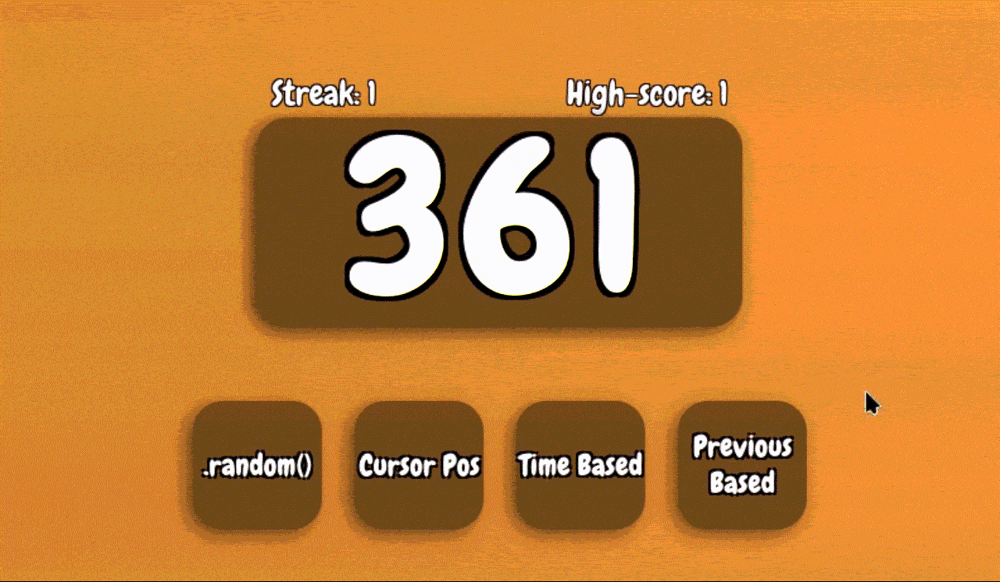

<div align="center">
    
# RNG Guessing


    
### A simple web game where you have to guess which RNG generated a number
### Also a Shakespearean narrator's soul got in and refuses to leave
$\color{gray} \text{My nameth isth Rouxls thou worms!!}$

---

### 🎮 [Play it now!](https://rng-guessing.vercel.app) 🎮

</div>

<br>

## Features
- FOUR different RNGs
- Shakespearean narrator that reacts differently based on what you do
- Sound effects
- Settings for volume and text speed
- High-score and Streak
- High-score and setting saving
- A graph and regenerate features to help you guess
- Everything scales (Not exactly phone friendly tho)
- A link to my main site that doesn't exist (yet)
- Confetti

<br>

## How it was made
### What I used:
- WebStorm for coding _(and this README)_
- GIMP for making images
- Audacity for a lil bit of audio editing
- Figma for design prototypes
- Google fonts for... fonts
- Canvas Confetti 1.9.4 by catdad for [REDACTED]

And of course HTML, CSS and JavaScript

<br>

## How to edit or run the project
### Simply download the files and well that's about it!

Just double-click the .HTML file to launch the site or open the whole folder in your IDE to edit it

If you do plan to edit it I recommend running this command _(requires npm)_:
```bash
npm install --save canvas-confetti
```
It installs the canvas confetti library and allows your IDE to recognize it properly _(the confetti will work without this though)_

<br>

## AI Disclosure
AI was used to help with discovering various things _(ex. How to add a stroke to text)_ and to understand and help with fixing random bugs
